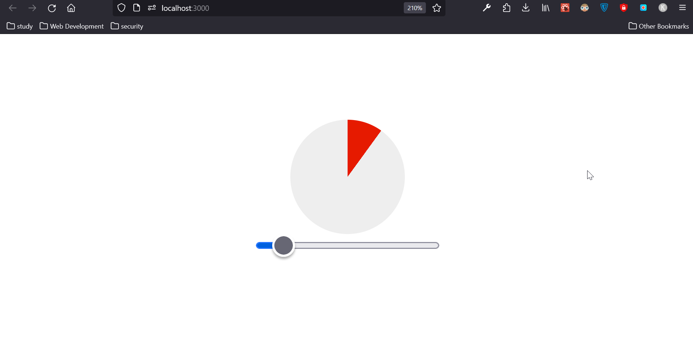
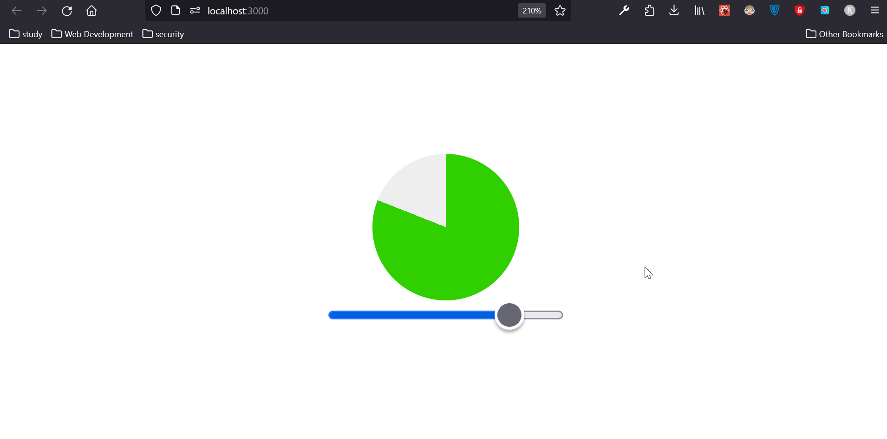

# Pi Chart With React App

Used Create React App and Styled Components to build Pi Chart component which changes it's shape and color on the basis of it's input.

 

## How to Play ?

1. Commands for command line to install react app ...
    - `git clone https://github.com/manik-dhanjal/react-pichart.git`
    - `npm install`
2. Commands for starting react app ...
    - `npm start`

3. Commands for creating the build ...
    - `npm run build`

 

## Screenshots

 

